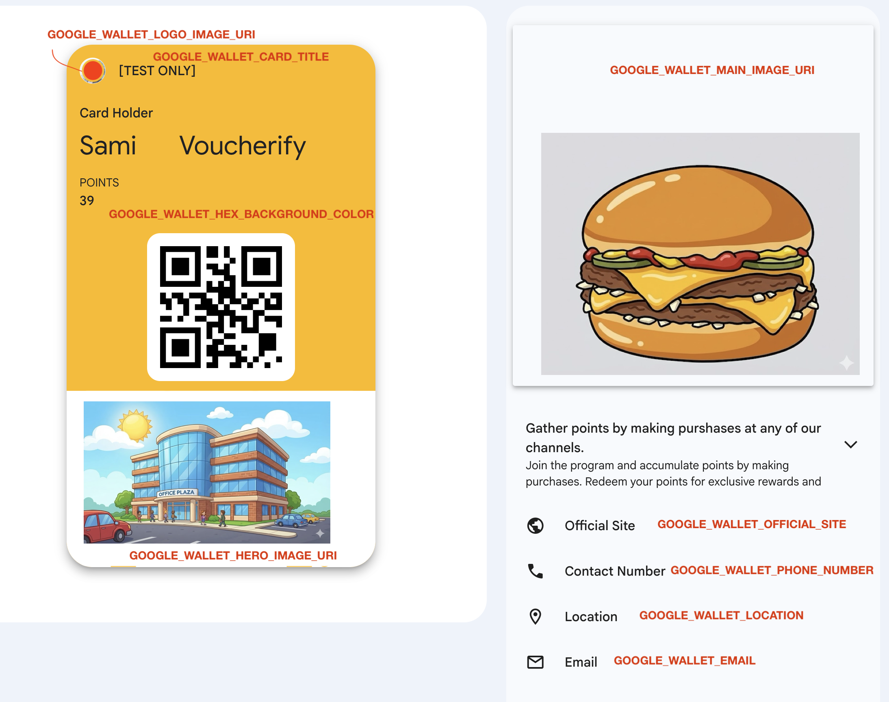

# Google Wallet with Voucherify

## Overview

This project connects Voucherify and google wallet to show the QR code, name and number of points on the loyalty card.

## Google Wallet Implementation Using Voucherify as Loyalty Engine

The way this works is:
1) Create a class in the google wallet schema if the class does not exist. 
2) Create an object within the class 
3) Update the points using Voucherify webhooks.

To customize to a customer and your Voucherify account, the following steps are required.

1) In the environment variables (.env), you can set the variables to your Voucherify environment. A .env.example file has been added. You need to remove the `.example` from the name of the file.

```
VOUCHERIFY_API_URL=https://api.voucherify.io
VOUCHERIFY_APPLICATION_ID=e55fXXX
VOUCHERIFY_SECRET_KEY=28ceXXX
LOYALTY_PROGRAM_ID=camp_CHu09uTA1IKE9JYtYxz1cbFd
LOYALTY_PROGRAM_NAME=Loyalty Program - Customer
VOUCHERIFY_WEBHOOK_SECRET=00302aX
```

2) In the environment variables, you can also set the following variables for the google wallet. Google Documentation provides information on how to setup the authentication for google services.

```
GOOGLE_WALLET_LOYALTY_CARD_CLASS_ID=customername
GOOGLE_WALLET_CARD_TITLE=MyCustomerProgram
GOOGLE_WALLET_HEX_BACKGROUND_COLOR=#fcba03
GOOGLE_WALLET_LOGO_IMAGE_URI=https://site.png see example in the logo.png image in the ./assets folder
GOOGLE_WALLET_HERO_IMAGE_URI=https://site.png see example in the hero.png image in the ./assets folder
GOOGLE_WALLET_MAIN_IMAGE_URI=https://site.png see example in the main.png image in the ./assets folder
GOOGLE_WALLET_OFFICIAL_SITE=https://site.com/
GOOGLE_WALLET_LOCATION=https://google.com/maps?q=voucherify
GOOGLE_WALLET_PHONE_NUMBER=tel:+1234567890
GOOGLE_WALLET_EMAIL=mailto:support@voucherify.io
```



3) ADD webhook URL in Voucherify to Home --> Project Settings --> General --> Webhooks, set it to ACTIVE and only send the `voucher.loyalty_card.transaction.created` event. Note: Once you deploy to a site, the webhook URL is the `{site}/voucherify-webhook`.

4) Deploy the app

```
node app.js
```

You can check the deployment locally, where you will be able to add the loyalty card to the wallet. 

```
http://localhost:3000/
```

5) If you would like to receive webhook events from Voucherify and have the points automatically update in the google wallet, you need to set up a reverse proxy such as ngrok.

Here are some more helpful links:
[Google Onboarding](https://developers.google.com/wallet/generic/getting-started/issuer-onboarding)
[Google Authentication](https://developers.google.com/wallet/generic/getting-started/auth/rest)
[Google CodeLab](https://developers.google.com/wallet/generic/resources/codelabs)
[Google PassBuilder](https://developers.google.com/wallet/generic/resources/pass-builder)
[Google Brand Guidelines](https://developers.google.com/wallet/generic/resources/brand-guidelines)
[Ngrok](https://ngrok.com/docs/how-ngrok-works)
